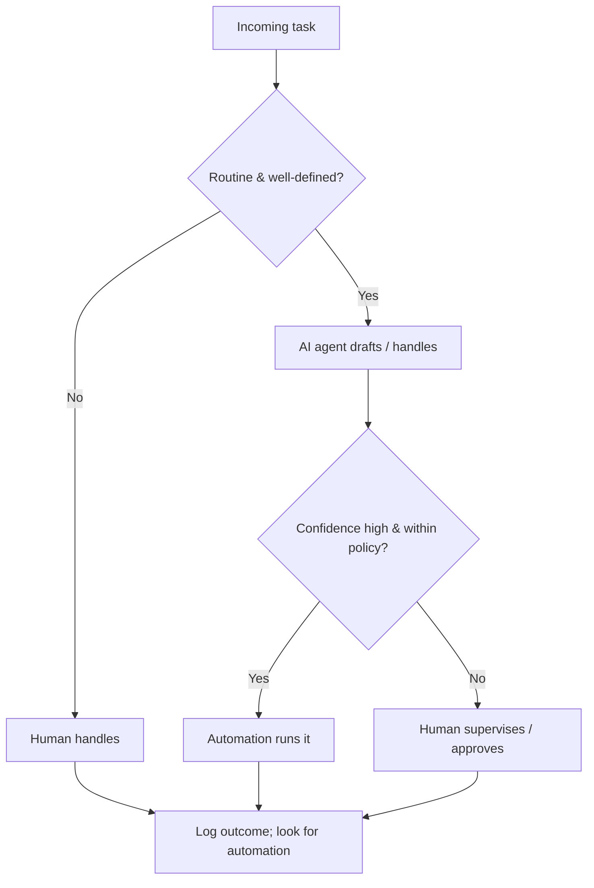

# Division of duties

How a typical back-office task routes across people, AI agents, and machines. The goal:
anyone can see at a glance what's **handled**, **supervised**, or still **manual**.

**Examples at Ridgeline**

| Task | Human | AI agent | Machine |
|---|---|---|---|
| Invoice import | Office Manager approves | Invoice Triage Bot | Invoice Import automation |
| Lead intake | Estimator reviews | Lead Concierge | Lead Intake Router |
| Review requests | — (autonomous) | Reputation Agent | Review Request Sender |
| Payroll | Bookkeeper approves | — | Payroll Run |
